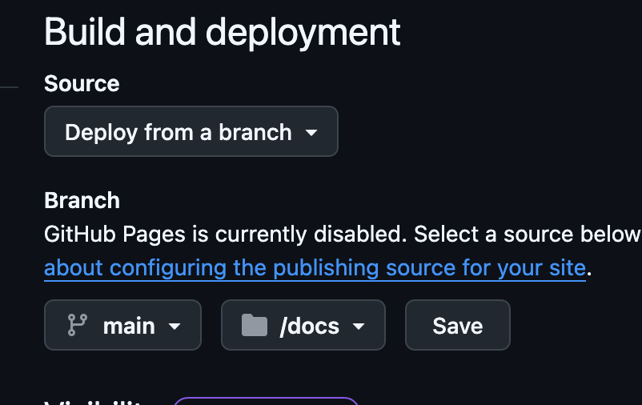

# Assignment 1

## Due September 11th before class. 

## Tasks

### create repo
Create a private github repository called `GAME551-Fall2025` and add me
(`tejaswigowda`) as
a collaborator. The repository should contain a `README.md` that has the
following information:

1. Your full name
2. Your ASU ID.

You will submit assignments using this repository. 

### add your glb viewer

Next add your scanned glb object (from last class) to this webXR ready project: https://github.com/tejaswigowda/game551-Fall2025/tree/main/digitalTwin-XR

### host on github pages

Please create a `/docs` folder and host your submission on Github pages: https://docs.github.com/en/pages

## Submision

- code on your gihub repo.
- url for hosted github site on canvas.

